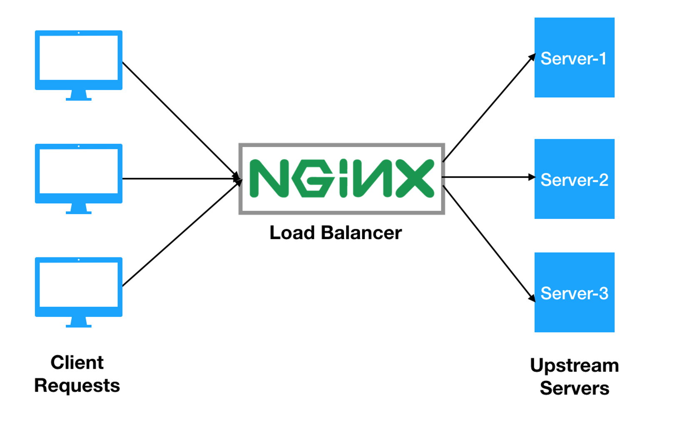

# QUASAR FIRE OPERATION API

To run the project locally (needs docker installed):
1. you should add the next environment variables into your preference ide:
```
APP_DB_USERNAME=postgres
APP_DB_PASSWORD=secret
APP_DB_NAME=quasar_fire_operation
APP_DB_HOST=localhost
APP_DB_PORT=5432
```
2. then you must run `docker-compose -f docker-compose-local.yml up -d` in order to get the database up and running.
3. launch the main.go in your IDE or using the `go run main.go` on the project root folder
4. If you want you can use the next command to run the project locally only with docker, 
   execute this on the project root folder `docker-compose up -d`, this approach will expose 
   the application in the port `4000` on the localhost

To run the project without the IDE or executing any additional command or configuration:
- just run `docker-compose up -d` on the project root folder

In order to run the tests in any environment you should run `docker-compose -f docker-compose.yml -f docker-compose.test.yml up`

In the project root folder you have the postman collection that you can import to postman in order
to get all the requests to use the service, if you execute the program locally it will expose the service
on the port `8080` if you use the docker command on the 4th point it will expose on the port `4000` using a load balancer

it uses a simple architecture based on microservices, can have multiple instances that are connected to a nginx load balancer
its pretty simple but effective, all the applications are connected to a postgresql database, when the service start running it will
execute database migrations in order to get the base data for the satellites coordinates for the ship position calculation.
All the aditional information of the use or every endpoint can be reached on the postman collection `quasar fire operation.postman_collection.json`
, it has all the information about all the endpoints that expose the service.

Live example can be used from this server: [http://45.158.199.116/api/v1/topsecret][http://45.158.199.116/api/v1/topsecret]




[http://45.158.199.116/api/v1/topsecret]: http://45.158.199.116/api/v1/topsecret